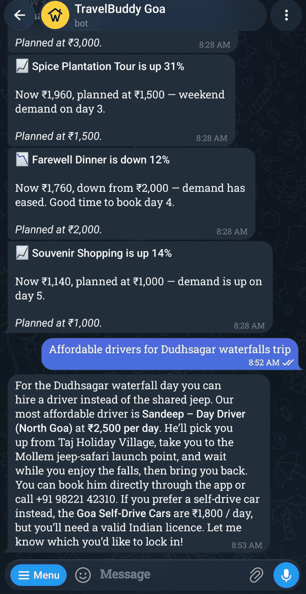
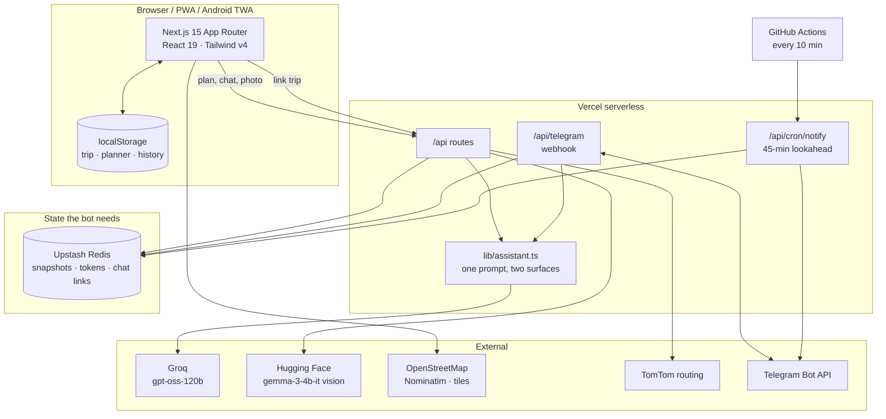

### 🌐 Live app &nbsp;→&nbsp; **https://travel-concierge-pi.vercel.app**

### 🤖 Telegram bot &nbsp;→&nbsp; **https://t.me/wayzyy_goa_bot**

No sign-up needed — there's a guest mode. Open it on a phone if you can, it's
built handset-first.

---

<div align="center">


# TravelBuddy

**A booking ends at checkout. The trip doesn't.**

An AI trip concierge for Goa — it plans the days, books the table, and then
stays with you on Telegram for the whole trip.

[](https://travel-concierge-pi.vercel.app)
[](https://t.me/wayzyy_goa_bot)


<sub>Built for **Geeks2Code 2026** · Wayzyy special track · **Team AlphaForge**</sub>

<br />


</div>

---

## The problem

Every travel app in India stops working the moment you've paid. You land in
Goa with a hotel confirmation and a group chat, and everything that actually
makes the trip good — where to eat tonight, whether the waterfall is worth the
two-hour drive, what to do now that it's raining — is back to being your
problem.

TravelBuddy covers the part after checkout. It learns what you like by
watching you swipe, builds a costed day-by-day plan you can edit, books you
into a partner network, and then follows you into Telegram so the plan is a
message away for the rest of the trip.

---

## What it does

<table>
<tr>
<td width="50%" valign="top">

### Swipe to be understood

21 cards — 7 vibes, 7 activities, 7 food — over real Goa photography. No
forms, no "rate your interest from 1 to 5". Pure-veg filters the deck. Swipe
left on everything and it puts two options head-to-head instead of giving up.

You can also just **point your camera at a photo** you like; a vision model
reads the scene and pre-seeds your preferences.

</td>
<td width="50%" align="center">

</td>
</tr>

<tr>
<td width="50%" align="center">

</td>
<td width="50%" valign="top">

### A plan you can argue with

Day-by-day, timed, costed against the budget split you set. Every stop can be
edited, moved or **replaced** with a real Goa alternative. Live demand pricing
moves costs through the day and tells you when something is worth rebooking.

Export the whole thing as a PDF to send to whoever isn't on the app.

</td>
</tr>

<tr>
<td width="50%" valign="top">

### It books, and it earns

Confirm a plan and the guest earns **Travel Cash** — credit that only spends
at partner venues, which is what pulls them into the network instead of to
whoever happens to be nearest. Every food, activity and transport stop also
surfaces bookable partners with prices, ratings and one-tap call or WhatsApp.

That's the business model, not a feature: **TravelBuddy takes 8–25%
commission** on what the itinerary funnels into, and a "Partner economics"
toggle on each stop shows the unit economics per booking.

</td>
<td width="50%" align="center">

</td>
</tr>

<tr>
<td width="50%" align="center">

</td>
<td width="50%" valign="top">

### Then it leaves the app

Link your plan to Telegram in one tap and the concierge follows you there.
It nudges you 45 minutes before each stop, flags price moves, answers
questions about your own itinerary, and knows the full partner network — so
"where should we eat tonight?" gets an answer you can actually book.

Share the link and your travel companions get the same bot, same plan.

In the shot beside this: live price alerts, then "affordable drivers for
Dudhsagar" answered with a named partner, a day rate and a number to call.

</td>
</tr>
</table>

### And it looks right in the dark

<div align="center">

</div>

Every surface is themed through design tokens, contrast-checked by
measurement rather than by eye, and follows the system setting unless you
override it in your profile.

---

## The Telegram bot

Message [**@wayzyy_goa_bot**](https://t.me/wayzyy_goa_bot), or link it from
the app to bind it to your trip.

| Command             | What it does                                          |
| ------------------- | ----------------------------------------------------- |
| `/start`            | Link a trip using the code from the app               |
| `/today`            | Everything happening today, with times and costs      |
| `/next`             | Just the next stop                                    |
| `/plan`             | The full itinerary, day by day                        |
| `/budget`           | What's been spent against what you set                |
| `/mute` · `/unmute` | Pause or resume nudges                                |
| `/help`             | The list above                                        |
| _anything else_     | Free-text question, answered against your actual plan |

Ask it "is Dudhsagar worth it on day 3?" or "cheap dinner near Anjuna" and it
answers from your itinerary and the partner network — not from generic
internet knowledge about Goa.

### Why Telegram, when India runs on WhatsApp

WhatsApp is where these travellers already are, and it is where this is
going. It is not where it starts, because the WhatsApp Business Platform
requires a verified Meta Business account and a reviewed WhatsApp Business
Account before a bot may message anyone — days of verification, with
business documents, and template approval for anything proactive. A trip
nudge is exactly the kind of proactive message that needs it.

Telegram needed a token from BotFather and no verification at all, so the
concierge is real today rather than pending review.

The channel is already an implementation detail: `Notifier` in
`src/lib/telegram.ts` is an interface, and the assistant, the schedule and
the price watcher never name a platform. WhatsApp lands as a second adapter
behind the same interface once verification clears — no change to how any
of this works.

---

## Architecture



**Three things worth knowing:**

1. **Trip state lives in the browser.** There is no user database. The app
   persists to `localStorage` per signed-in email, so a trip belongs to a
   device until you link it out.
2. **One assistant, two surfaces.** `src/lib/assistant.ts` holds the Groq call
   and the prompt. The in-app support chat and the Telegram bot both call
   `ask()`, so the itinerary changes once and every surface sees it.
3. **Transport is an interface.** `Notifier` in `src/lib/telegram.ts` abstracts
   the channel — WhatsApp drops in as a second adapter without touching the
   assistant.

---

## Tech stack

| Layer     | Choice                            | Why                                         |
| --------- | --------------------------------- | ------------------------------------------- |
| Framework | Next.js 15 (App Router), React 19 | One deployable for UI and API               |
| Styling   | Tailwind CSS v4, CSS modules      | Token-driven theming, full dark mode        |
| Motion    | Framer Motion                     | Swipe physics and screen transitions        |
| LLM       | Groq · `openai/gpt-oss-120b`      | Fast enough to feel like a chat, not a form |
| Vision    | Hugging Face · Gemma 3 4B         | Photo → preference tags. Open weights on HF |
| Store     | Upstash Redis (REST)              | Serverless-safe, no TCP pooling             |
| Auth      | NextAuth v5 · Google OAuth        | Sign-in only, never in an answer            |
| Maps      | OpenStreetMap, Nominatim, TomTom  | No billing key needed to demo               |
| Messaging | Telegram Bot API                  | Free, instant, no business verification     |
| Hosting   | Vercel + GitHub Actions cron      | Hobby tier only allows daily crons          |

**Every answer comes from Groq.** The in-app chat and the Telegram bot both
call one function, `ask()` in `src/lib/assistant.ts`, which talks to Groq and
nothing else. Google appears in exactly two places and neither is in the
answer path: OAuth sign-in, and as the author of the Gemma weights that
Hugging Face serves for photo tagging. No Google API is called at runtime.

---

## Repository layout

```
.
├── .github/workflows/
│   └── trip-notifications.yml   # 10-min sweep → /api/cron/notify
└── travelbuddy/
    ├── travel-buddy/            # the Next.js app — everything live
    │   ├── src/app/             # routes + API handlers
    │   ├── src/components/      # travel/, itinerary/, onboarding/, auth/
    │   ├── src/lib/             # assistant, telegram, store, pricing, schedule
    │   ├── src/data/            # vendors, sponsors, Goa knowledge base
    │   ├── public/goa/          # 55 photographs
    │   └── SKILL.md             # working notes, read this before contributing
    └── server/                  # Node/Express + Gemini agent — NOT deployed,
                                 # and not what the chat or bot use
```

---

## Running it locally

```bash
git clone https://github.com/raunak23427/travel-concierge.git
cd travel-concierge/travelbuddy/travel-buddy
npm install
cp .env.example .env.local   # then fill it in, see below
npm run dev
```

Open <http://localhost:3000>. The app works with **no keys at all** — it falls
back to a local Goa knowledge base — but the assistant, photo analysis and
Telegram bot need theirs.

```bash
npm run typecheck   # tsc --noEmit
npm run build       # production build
npm run test:travel # Playwright
```

### Environment variables

| Variable                   | Needed for                  | Without it                                         |
| -------------------------- | --------------------------- | -------------------------------------------------- |
| `GROQ_API_KEY`             | Assistant + Telegram Q&A    | Chat returns a 503                                 |
| `HF_TOKEN`                 | Photo → preferences         | Camera step offers Skip                            |
| `TELEGRAM_BOT_TOKEN`       | The bot                     | Telegram features hidden                           |
| `TELEGRAM_WEBHOOK_SECRET`  | Webhook auth                | Webhook accepts anything                           |
| `NEXT_PUBLIC_TELEGRAM_BOT` | Deep link in the UI         | Link button shows setup help                       |
| `UPSTASH_REDIS_REST_URL`   | Bot state                   | Falls back to in-memory; links die between lambdas |
| `UPSTASH_REDIS_REST_TOKEN` | ″                           | ″                                                  |
| `CRON_SECRET`              | Protecting the notify sweep | Endpoint is open                                   |
| `AUTH_SECRET`              | NextAuth session signing    | Sign-in fails                                      |
| `AUTH_URL`                 | OAuth callback              | Redirects to the wrong host                        |
| `GOOGLE_CLIENT_ID`         | Google sign-in              | Sign-in button fails                               |
| `GOOGLE_CLIENT_SECRET`     | ″                           | ″                                                  |
| `TOMTOM_API_KEY`           | Drive times                 | Falls back to OSRM                                 |

---

## Honest status

This is a hackathon prototype, and the README should say which parts are real:

- ✅ **Real:** the full plan → swipe → itinerary → confirm flow, the Telegram
  bot end to end, the Groq assistant, photo analysis, dark mode, PDF export,
  Google sign-in, durable bot state on Upstash.
- ⚠️ **Sample data:** the 18 partner vendors are real Goa venues with realistic
  prices, but the **phone numbers are placeholders** and no partner agreement
  exists. Nothing here is a live booking network.
- ❌ **Not deployed:** `travelbuddy/server/` — the Node/Express agent. The web
  app falls back to its local knowledge base and does not call it.

---

## Team

**AlphaForge** — Geeks2Code 2026, Wayzyy special track.

|                               |                                                |
| ----------------------------- | ---------------------------------------------- |
| **M Rayhan Khan** — Team Lead | [@mrayhankhan](https://github.com/mrayhankhan) |
| Raunak Kumar Giri             | [@raunak23427](https://github.com/raunak23427) |
| Dhruv Malhan                  | [@dhruv23203](https://github.com/dhruv23203)   |

<div align="center">
<br />
<a href="https://travel-concierge-pi.vercel.app">

</a>
</div>
