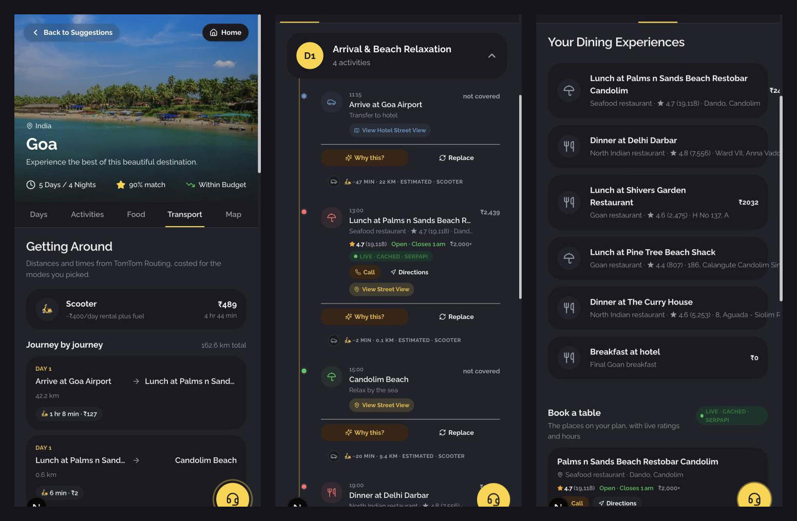
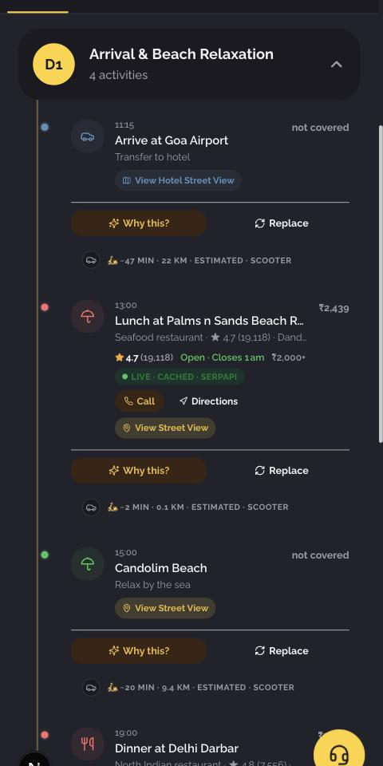
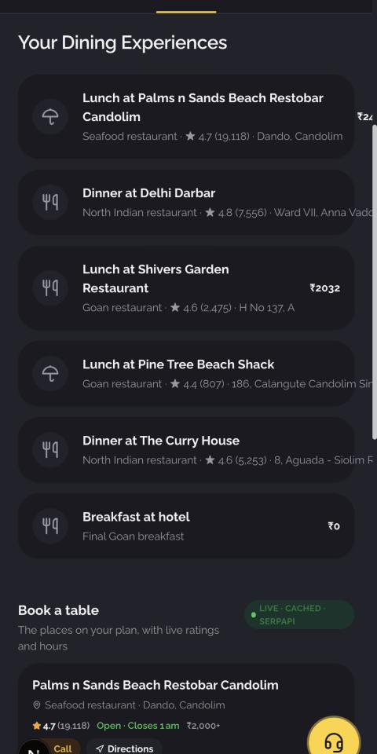
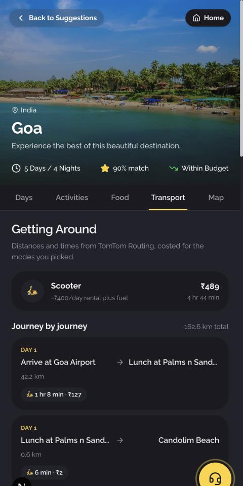
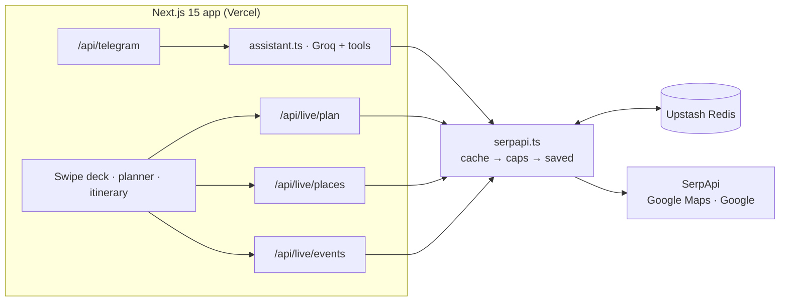

### 🌐 Live app &nbsp;→&nbsp; **https://travel-concierge-pi.vercel.app**

### 🤖 Telegram bot &nbsp;→&nbsp; **https://t.me/wayzyy_goa_bot**

Use a phone if you can — it is built handset-first.

---

<div align="center">


# TravelBuddy

**Swipe on photos of Goa. Get a plan made of real places — found live, near where you're staying.**

[](https://travel-concierge-pi.vercel.app)
[](https://serpapi.com)

<sub>SerpApi India Hackathon 2026 · Travel & Local Discovery · Team AlphaForge</sub>

<br />



</div>

---

## The idea

Trip planners hand you a list. The list is either generic ("visit a beach") or
stale (a restaurant that closed last year), and none of it knows where you're
staying.

TravelBuddy never asks you to type a query. You swipe on 21 photographs of Goa,
and the tags on the cards you keep — _Sea, Gastronomy, Adrenaline, Heritage_ —
are compiled into local searches around your stay. The results become your
plan: every food and activity stop is a real place from Google Maps, with its
rating, review count, opening hours, phone number and directions.

## How it uses SerpApi

| Engine                                                          | Where                                                                             | Why it matters                                                                                                                         |
| --------------------------------------------------------------- | --------------------------------------------------------------------------------- | -------------------------------------------------------------------------------------------------------------------------------------- |
| **Google Maps** (`google_maps`, `type=search`, `ll=@lat,lng,z`) | Building the itinerary · Replace a stop · Booking rows · Transport · Telegram bot | Every named stop is a real place with live rating, reviews, `open_state`, phone and coordinates — searched around the guest's own stay |
| **Google** (events block)                                       | "Happening during your trip" · the bot's `search_events` tool                     | Gigs, festivals and theatre in the trip's date window                                                                                  |

**One plan ≈ 7 searches**, run in parallel with the planner so they add no wait:

```
Swipes kept                       Compiled search (around a stay at Candolim)
───────────────────────────────   ───────────────────────────────────────────
Sea, Beach, Gastronomy         →  seafood beach shack near Candolim
Local, Culture, Warm           →  authentic Goan restaurant near Candolim
Water, Adrenaline, Sport       →  water sports near Candolim
Culture, Heritage              →  heritage churches Old Goa
Nightlife, Party, Music        →  nightclub near Candolim
the vegetarian deck            →  pure veg thali restaurant near Candolim
```

Results are ranked by rating × log(reviews) — so a 4.9 with six reviews doesn't
outrank a 4.5 with three thousand — then interleaved across preferences so the
plan is as varied as the profile that produced it. Evenings go to nightlife;
hotel meals and travel legs are left alone.

The same pool powers **Replace** (siblings of the search that produced a stop,
at no extra credit) and the **booking rows**. The **Telegram bot** gets
`search_places` and `search_events` as tools, so _"cheap dinner near Anjuna?"_
is answered from a live search, with the place's rating and phone number.

### Spending credits carefully

The free plan is 250 searches a month, so every search goes through:

1. a **48-hour Redis cache** keyed on query and rounded location — a repeat plan costs nothing;
2. **daily and monthly credit caps** (`SERPAPI_DAILY_CAP`, `SERPAPI_MONTHLY_CAP`) and a per-IP rate limit on every route;
3. **Demo Mode** — real SerpApi responses saved by [`scripts/capture-serp-snapshots.ts`](travelbuddy/travel-buddy/scripts/capture-serp-snapshots.ts), served when there's no key or the cap is hit, matched to the nearest saved query.

Every result carries where it came from — `live`, `cached`, `saved` or
`offline` — and the UI shows it on every card. A saved example is never shown
as live.

## Screens

<table>
<tr>
<td width="33%" align="center"><br/><sub>Every stop a real place — rating, hours, call, directions</sub></td>
<td width="33%" align="center"><br/><sub>Dining on the plan, then booking rows from the same search</sub></td>
<td width="33%" align="center"><br/><sub>Routed with TomTom; rentals and taxis searched live</sub></td>
</tr>
</table>

## Architecture


```mermaid
flowchart LR
    subgraph app["Next.js 15 app (Vercel)"]
        UI["Swipe deck · planner · itinerary"]
        PLAN["/api/live/plan"]
        PLACES["/api/live/places"]
        EVENTS["/api/live/events"]
        BOT["/api/telegram"]
        ASK["assistant.ts · Groq + tools"]
    end
    SERP["serpapi.ts<br/>cache → caps → saved"]
    KV[("Upstash Redis")]
    SA["SerpApi<br/>Google Maps · Google"]
    UI --> PLAN & PLACES & EVENTS
    BOT --> ASK --> SERP
    PLAN & PLACES & EVENTS --> SERP
    SERP <--> KV
    SERP --> SA
```

| Layer                    | Choice                                        |
| ------------------------ | --------------------------------------------- |
| App                      | Next.js 15, React 19, Tailwind v4, TypeScript |
| Live local data          | **SerpApi** — Google Maps and Google          |
| Assistant                | Groq `openai/gpt-oss-120b` with tool calling  |
| Photo → preferences      | Hugging Face, Gemma 3 4B (open weights)       |
| Routing                  | TomTom                                        |
| Cache, budget, bot state | Upstash Redis (REST)                          |
| In-trip channel          | Telegram Bot API                              |

## Run it locally

```bash
git clone https://github.com/raunak23427/travel-concierge.git
cd travel-concierge/travelbuddy/travel-buddy
npm install
cp .env.example .env.local     # add SERPAPI_API_KEY
npm run dev                    # http://localhost:3000
```

**One key is enough to see the core:** with only `SERPAPI_API_KEY` set, plans,
booking rows, transport and events are live. With **no key at all** the app
runs in Demo Mode on saved responses, labelled as such.

To refresh the saved responses from real searches:

```bash
npx tsx --env-file=.env.local scripts/capture-serp-snapshots.ts
```

| Variable                                                                    | Needed for                                                     |
| --------------------------------------------------------------------------- | -------------------------------------------------------------- |
| `SERPAPI_API_KEY`                                                           | Live search — the core of the app                              |
| `SERPAPI_DAILY_CAP` / `SERPAPI_MONTHLY_CAP`                                 | Credit caps (default 40 / 230)                                 |
| `UPSTASH_REDIS_REST_URL` / `_TOKEN`                                         | Cache and caps across serverless instances (in-memory without) |
| `GROQ_API_KEY`                                                              | The assistant and the bot's live tools                         |
| `TELEGRAM_BOT_TOKEN`, `TELEGRAM_WEBHOOK_SECRET`, `NEXT_PUBLIC_TELEGRAM_BOT` | The Telegram bot                                               |
| `TOMTOM_API_KEY`                                                            | Drive times (falls back to estimates)                          |
| `HF_TOKEN`                                                                  | Photo → preference tags                                        |
| `AUTH_SECRET`, `AUTH_URL`, `GOOGLE_CLIENT_ID`, `GOOGLE_CLIENT_SECRET`       | Google sign-in (guest mode works without)                      |

## What was built for this hackathon

TravelBuddy existed before the hackathon as a Goa trip planner with a static
place list. **Everything SerpApi was built for this hackathon** and is
identifiable in history: commits are prefixed `serpapi:`, and the tag
[`pre-serpapi`](https://github.com/raunak23427/travel-concierge/compare/pre-serpapi...main)
marks the baseline — that compare view is the full diff.

Built for this event: the SerpApi client, cache and credit budget; the
swipe-to-search compiler; live itineraries, Replace and booking rows; live
transport and events; the bot's search tools; Demo Mode.

## Honest status

- ✅ Live: plans, Replace, booking rows, transport and events from SerpApi; the Telegram bot's live answers; Google sign-in; durable Redis state.
- ⚠️ Costs on the plan are budget estimates from the guest's split, not quotes.
- ⚠️ Free-plan limits apply; Demo Mode covers the rest and says so on screen.

## Team

**AlphaForge**

|                                   |                                                |
| --------------------------------- | ---------------------------------------------- |
| **Rayhankhan Pathan** — Team Lead | [@mrayhankhan](https://github.com/mrayhankhan) |
| Raunak Kumar Giri                 | [@raunak23427](https://github.com/raunak23427) |
| Dhruv Malhan                      | [@dhruv23203](https://github.com/dhruv23203)   |
